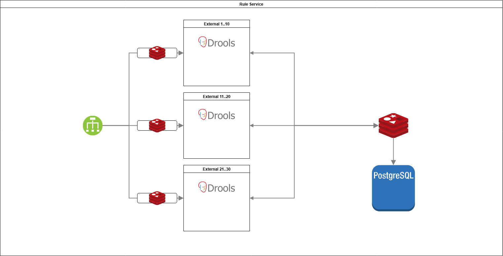

# 🧠 Apache Kie Rule Engine Module
## Dynamic Rule Engine for Any System

A modular, extensible Drools-based rule engine (now branded as Apache Kie) designed to empower dynamic business logic, decision automation, and event-based reasoning across any enterprise or microservice system.

---

## Architecture Overview


## ✅ Core Features

### Rule Execution Engine
- **Dynamic Rule Management** via externalized Drools DRL files or templates
- **Stateless & Stateful Sessions** for flexible execution scenarios
- **Domain-Driven Rule Modeling** using POJOs and annotations
- **KieScanner Support** for live rule updates without restarts
- **Rule Chaining** and **Agenda Groups** for advanced control of rule flows

### Extensibility & Flexibility
- Plug-and-play integration with any system via Spring or REST APIs
- Supports **custom global variables**, **accumulate**, and **salience**
- Complex nested condition evaluation with **Condition Groups** and **Templates**
- Easily embeddable in existing services or deployable as a standalone service

### Reliability & Maintainability
- **Audit Logs** of rule execution and matched facts
- **Testable Rule Units** using JUnit + Kie APIs
- **Error Handling & Logging** for misfires and exceptions
- Supports versioning of rule templates and deployments

---

## 🔐 Use Cases

- Eligibility checks and validations
- Discount & pricing engines
- Fraud detection & prevention logic
- Policy enforcement systems
- Workflow and decision automation

---

## 🛠️ Tech Stack

Built with modern and proven technologies:

- **Apache Kie / Drools 10+** (Kogito-based architecture)
- **Spring Boot** for seamless integration
- **PostgreSQL** (optional) for rule metadata and versioning
- **KieServer API** (optional) for external execution
- **Kogito** (optional) for cloud-native deployments

---

## 🧪 Testing

Drools rules can be unit tested using Kie APIs:

```java
KieSession kieSession = kieContainer.newKieSession();
// insert facts
kieSession.insert(new MyFact());
// fire rules
kieSession.fireAllRules();
kieSession.dispose();
```

Or wrap in try-with-resources:

```java
try (KieSession kieSession = kieContainer.newKieSession()) {
    kieSession.insert(myFact);
    kieSession.fireAllRules();
}
```

---

## 🐳 Docker

You can deploy the rule engine as a containerized microservice for easier scalability.

### Build Image

```sh
docker build -t <youruser>/rule-engine:latest .
```

### Run Container

```sh
docker run -d -p 9000:8080 --restart=always --name rule-engine <youruser>/rule-engine:latest
```

### Access Service

```sh
http://127.0.0.1:9000
```

Use `KIE_BASE_NAME` and `KIE_SESSION_NAME` as environment variables to control which rules get loaded.

---

## 🔄 Integration Patterns

- REST API with JSON-based fact ingestion
- gRPC (optional) for high-throughput environments
- Spring EventListener or Kafka-based async rule triggers
- Webhooks or direct service-to-service rule evaluation

---

## 📂 Example Directory Structure

```
├── src
│   ├── main/java/com/example/rules
│   ├── main/resources/rules/
│   │   ├── eligibility.drl
│   │   └── pricing.drl
├── Dockerfile
├── README.md
└── pom.xml
```

---

## 🧩 Optional Modules

- **Rule Editor UI** for managing templates and rule versions
- **Rule Metrics** via Micrometer or Prometheus
- **Dynamic Condition Builder** from DB or Admin UI

---

## 🚀 Getting Started

Clone the repository and follow the standard Maven lifecycle:

```sh
mvn clean install
```

Then run it locally:

```sh
java -jar target/rule-engine.jar
```